# 🎓 DIUHub - A Centralized QR-Enabled Platform for University Clubs and Events

DIUHub is a **full-stack web application** designed for Daffodil International University to digitally manage **clubs, events, and attendance** using QR technology.

It replaces manual processes with a **secure, role-based, and automated system**.

---

## 🎯 Project Overview

- **Goal:** Automate attendance and event management using QR codes
- **Approach:** Django-based system with role-based access and real-time QR validation
- **Use Case:** University clubs, student organizations, and academic events

---

## ✨ Core Features

### 👤 User Management

- Secure login & registration
- Role-based system (Student / Admin / Superadmin)
- Editable student profile

---

### 🏫 Club System

- View all clubs
- Join request system
- Approval-based membership
- Membership status tracking (Pending / Approved / Rejected)

---

### 📅 Event System

- Club-specific events
- Restricted registration (only approved members)
- Real-time registration tracking

---

### 📱 QR Code System

- Unique QR for each event registration
- Student “My QR” dashboard
- Secure QR validation (user_id + event_id based)

---

### 📷 Attendance System

- QR-based attendance scanning (webcam)
- Duplicate scan prevention
- Timestamp recording
- Attendance status tracking (Present / Absent)

---

### 📊 Admin Features

- Attendance report system
- Event-wise statistics:
  - Total registered
  - Present
  - Absent

- Membership request management

---

### 🔐 Role-Based Access Control

| Role       | Permissions                                            |
| ---------- | ------------------------------------------------------ |
| Student    | View clubs, join, register events, view QR, attendance |
| Admin      | Scan attendance, manage requests, view reports         |
| Superadmin | Full system control                                    |

---

## 📁 Project Structure

```
DIUHub/
├── users/             # Authentication & profile system
├── clubs/             # Club management
├── events/            # Event + QR generation
├── registrations/     # Event registrations
├── attendance/        # QR attendance system
├── templates/         # HTML templates
├── static/            # CSS, JS, assets
├── media/             # QR images
├── screenshots/       # Project screenshots
├── manage.py
└── requirements.txt
```

---

## ⚙️ Installation & Setup

### 1️⃣ Clone Repository

```bash
git clone https://github.com/simantapundori/DIUHub.git
cd DIUHub
```

---

### 2️⃣ Create Virtual Environment

```bash
python -m venv venv
```

Activate:

```bash
venv\Scripts\activate   # Windows
```

---

### 3️⃣ Install Dependencies

```bash
pip install -r requirements.txt
```

---

### 4️⃣ Database Setup

```bash
python manage.py makemigrations
python manage.py migrate
```

---

### 5️⃣ Create Superuser

```bash
python manage.py createsuperuser
```

---

### 6️⃣ Run Server

```bash
python manage.py runserver
```

Visit:

```
http://127.0.0.1:8000/
```

---

## 🔄 System Workflow

1. User registers and logs in
2. Student joins a club → approval required
3. Registers for an event
4. System generates a unique QR code
5. Admin scans QR via webcam
6. Attendance is validated and marked instantly

---

## 🏗️ System Architecture

**Three-Tier Architecture**

- **Presentation Layer:** HTML, CSS, JavaScript (UI + QR Scanner)
- **Application Layer:** Django Backend (logic, validation, control)
- **Data Layer:** SQLite Database (users, clubs, events, attendance)

---

## 🛠️ Technologies Used

- **Backend:** Django (Python)
- **Frontend:** HTML, CSS, JavaScript
- **Database:** SQLite
- **QR System:** qrcode, html5-qrcode
- **Authentication:** Django Auth

---

## 📸 Screenshots

### 📊 Student Dashboard

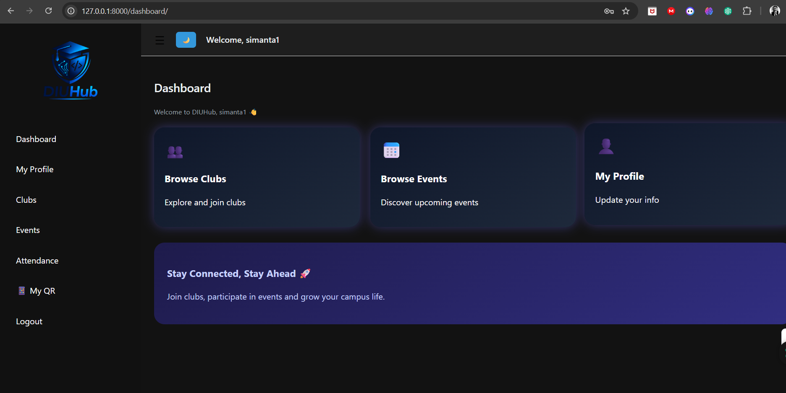

### 🛠️ Admin Dashboard

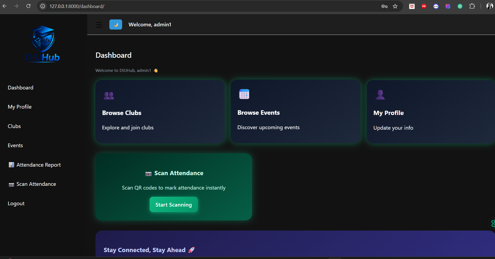

---

### 📱 My QR (Student)

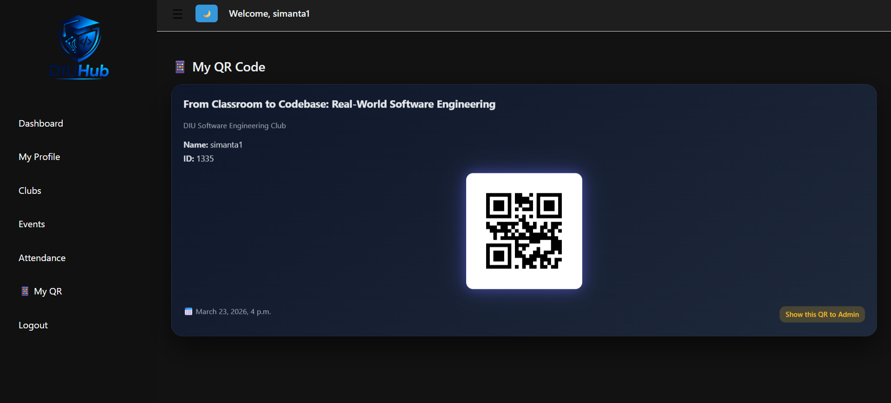

### 📷 Attendance Scan

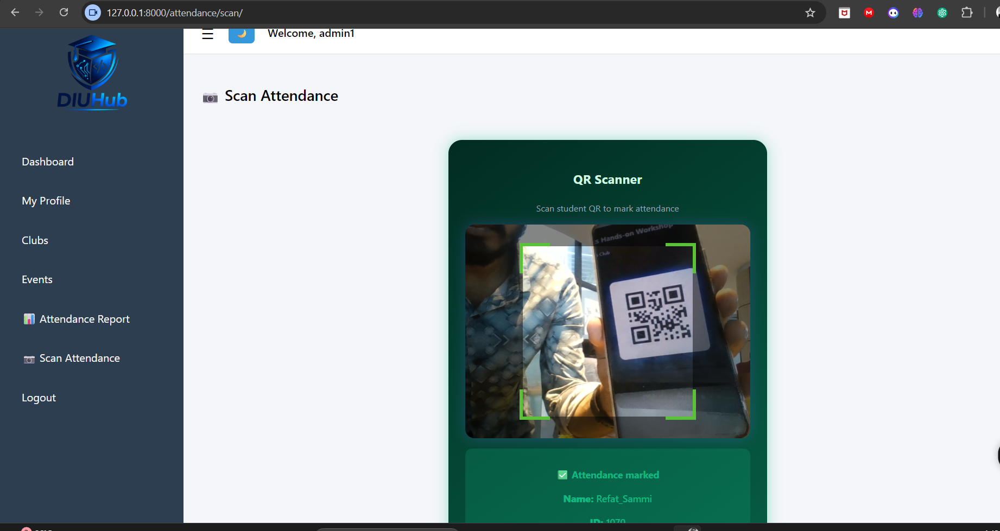

---

### 📷 Attendance (Student View)

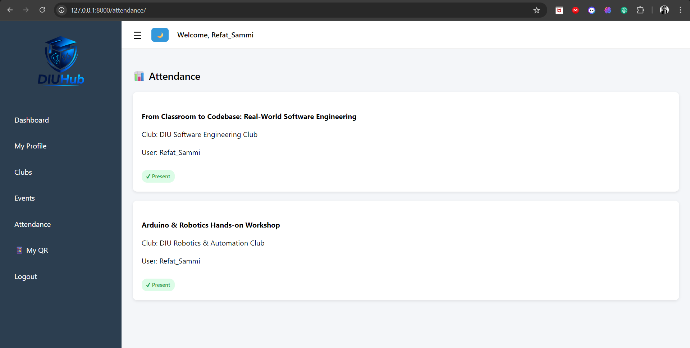

### 📊 Attendance Report (Admin)

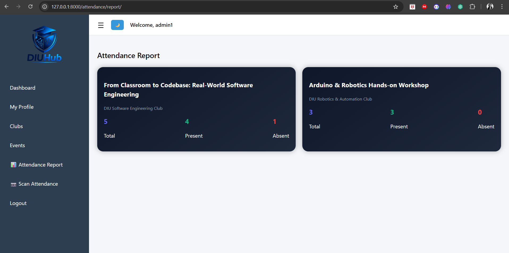

---

### 🏫 Clubs

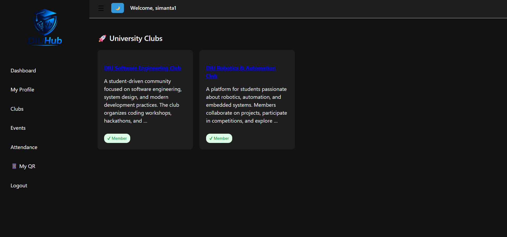

### 📥 Membership Management (Admin)

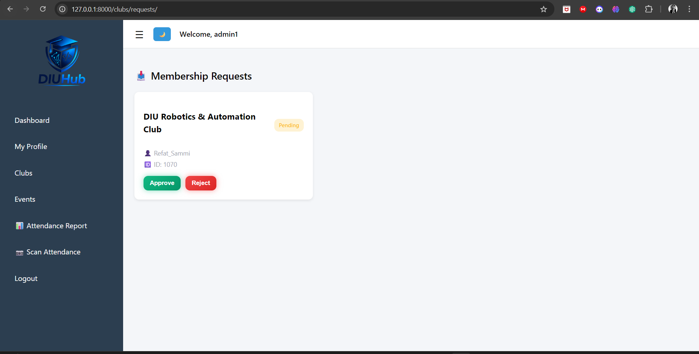

### 📅 Events

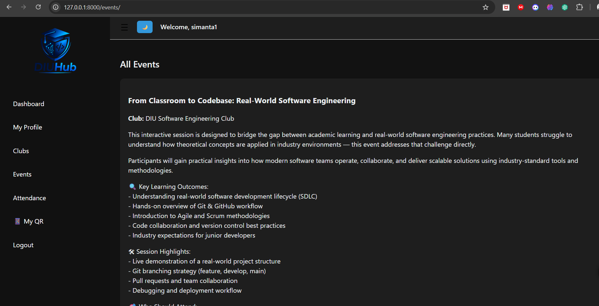

---

### 🔐 Login Page

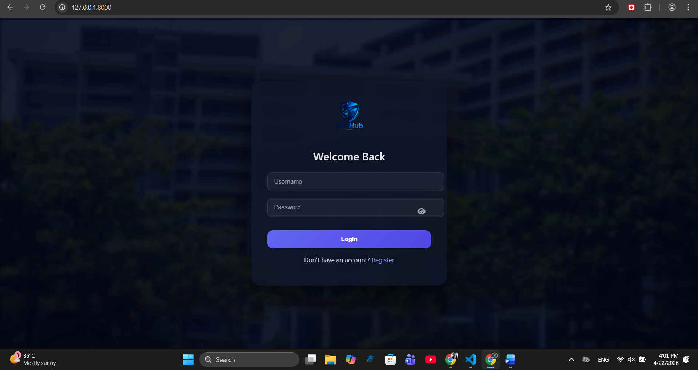

### 📝 Registration Page

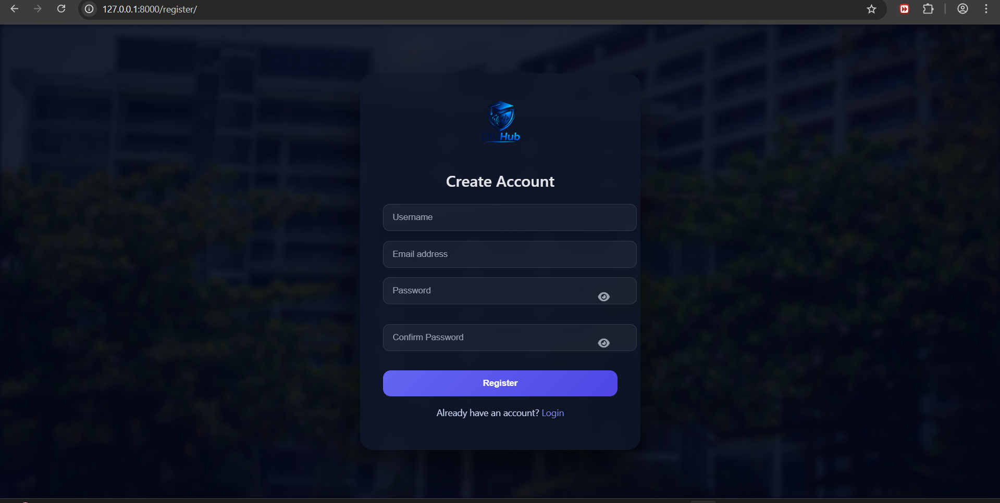

---

## 📊 Key Functional Highlights

- ✔ QR-based automated attendance
- ✔ Role-based access control
- ✔ Membership approval workflow
- ✔ Real-time validation system
- ✔ Clean UI with dark mode
- ✔ Toast notification system

---

## 👥 Team Contribution

| Member                           | Contribution                                                                               |
| -------------------------------- | ------------------------------------------------------------------------------------------ |
| **Simanta Kumer Pundori (1335)** | Authentication, Dashboard (Admin & Student), Club System, UI Polishing, System Integration |
| **Refat E Islam Shammi (1070)**  | Event System, Event Registration, Frontend UI                                              |
| **Israt Jahan Ifti (1191)**      | QR Generation, QR Scanning, Attendance System                                              |

---

## 🧩 Future Enhancements

### 🔐 Security & Authentication

- Forgot password system
- Email verification
- Mobile OTP validation

### 💬 Communication

- Feedback system
- Chatbox (Admin ↔ Student)
- Notification system

### 📄 Academic Features

- Certificate generation system

### 📊 Admin Improvements

- Analytics dashboard
- Export attendance to Excel

### 📱 Performance

- Mobile camera optimization

---

## 👨‍💻 Author

**Simanta Kumer Pundori**
Software Engineering Student
Daffodil International University

---

## ⭐ Final Note

This project demonstrates:

- Full-stack web development
- Real-world system design
- Role-based architecture
- QR-based automation

👉 Built as a **capstone-level university project with real deployment potential**
